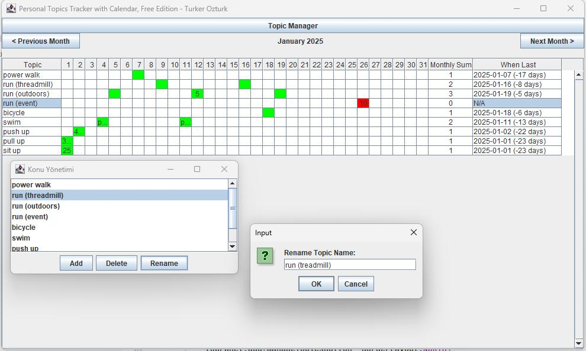
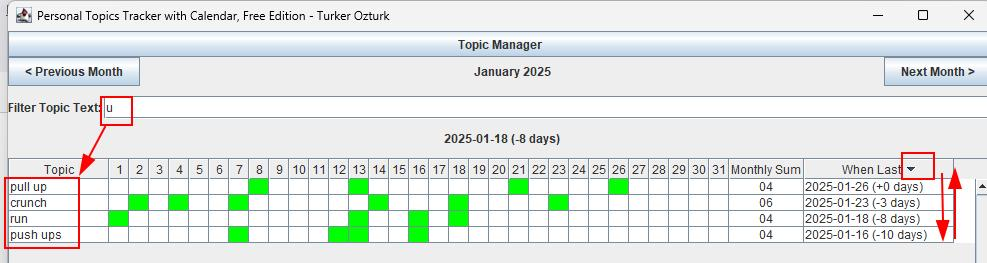

# Personal Topics Tracker with Calendar - Türker Öztürk

Personal Topics Tracker with Calendar is a desktop application designed to help you track your daily activities, workouts, and other topics in an easy-to-use calendar view. The application allows you to log, update, and analyze your progress across various topics on a monthly basis.

### Direct Download
    
https://github.com/turkerozturk/PersonalTopicsTrackerWithCalendar/releases/download/v1.0-SNAPSHOT/PersonalTopicsTrackerWithCalendar-1.0-SNAPSHOT.jar

### Release Notes
    
https://github.com/turkerozturk/PersonalTopicsTrackerWithCalendar/releases/tag/v1.0-SNAPSHOT

## Features

Calendar-Based Tracking: View and log your daily activity for different topics in a calendar layout.

Topic Management: Add, delete, or rename topics using the "Topic Manager" window.

### Data Overview:

Monthly Sum: Automatically calculates the total number of the cells with green background color for each topic in a given month.

When Last: Provides the date of the last cell marked with a green background for each topic and the number of days between that date and today.

Notes: Notes can be written inside the cells.
    
SQLite Database: Data is stored locally in an SQLite database, created automatically in the same directory as the application. You can also view and edit the database using external programs.

Lightweight: Runs as a standalone JAR file without the need for complex setup.

## System Requirements

Operating System: Windows, macOS, or Linux
Java Version: Java Runtime Environment (JRE) 8 or higher
Display Resolution: Minimum 1000x600 pixels

## Installation and Usage

### Download the Application:

Download the PersonalTopicsTrackerWithCalendar-1.0-SNAPSHOT.jar file from the Releases page.

### Run the Application:

Open a terminal or command prompt and navigate to the directory where the JAR file is saved.
Run the following command:

java -jar PersonalTopicsTrackerWithCalendar-1.0-SNAPSHOT.jar

### First Launch:
    On the first launch, the application will create an empty SQLite database in the same directory as the JAR file.
    The database stores all your topics and activity logs.

## How to Use
1. Logging Activities:

Click on a cell in the calendar to log your activity for a specific day and topic.
Enter the number or description of the activity and press Enter.

2. Managing Topics:

Open the "Topic Manager" window to:
    Add: Add new topics to the list.
    Delete: Remove existing topics and all related log data.
    Rename: Update the name of a topic.

3. Filter topics:

Use the search box to filter topics by contains text.

4. Understanding Columns:

Topic: The name of the activity or topic you are tracking.
Calendar Days: Each day of the current month. Cells display activity counts or descriptions.
Monthly Sum: Total activity count for the current month.
When Last: The last modified date of the topic, shown in YYYY-MM-DD format, with the number of days since (or until) that date in parentheses.

A single left-click selects a cell.
The first right-click on a cell marks it green, increasing the total sum by one and updating the "When Last" value if the green cell is the most recent date.
The second right-click marks the cell red. This does not affect the monthly total or the "When Last" value. The purpose is to draw attention to the cell, for example, for a future event or a missed activity in the past.
The third right-click turns the cell white. If the cell contains text, the text is not deleted. The cell's creation and modification date are retained in the database, even if there is no text. The cell can be marked green or red again later if needed.
A double left-click allows editing the text inside the cell.

All actions mentioned above are saved to the database immediately.
When navigating between months, there may be a delay in displaying data, as all information for the selected month is retrieved one by one from the database.

When the mouse pointer hovers over a cell, any text within the cell is displayed both in the upper-left area outside the table and as a tooltip near the mouse cursor.

It performs alphabetical sorting in ascending or descending order when the column headers are clicked.

Example Usage

    Tracking Workouts:
        Add topics like "Power Walk," "Run (Outdoors)," or "Bicycle."
        Log the number of minutes or distance covered for each day.

    Analyzing Progress:
        Use the Monthly Sum column to view totals for each topic.
        Check the When Last column to ensure consistency in your routine.

## Data Storage

The application uses an SQLite database for storing data.
The database file is located in the same directory as the JAR file and can be opened with any SQLite-compatible software for external analysis or backup.

License

This project is licensed under the Apache 2.0 License. It includes the SQLite JDBC driver, See the LICENSE and NOTICE files for more details;
https://github.com/xerial/sqlite-jdbc/blob/master/LICENSE
